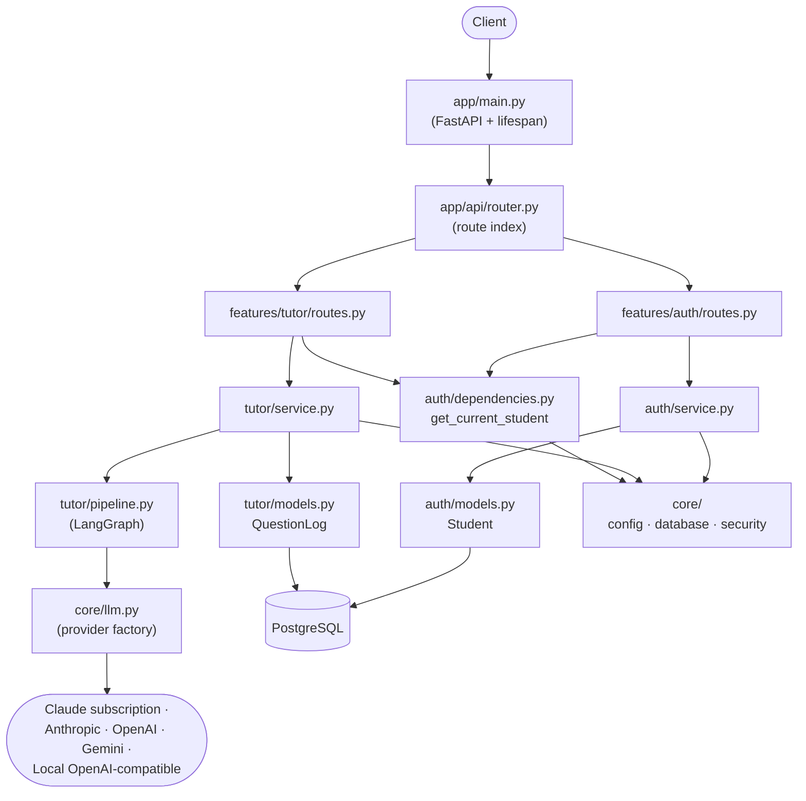
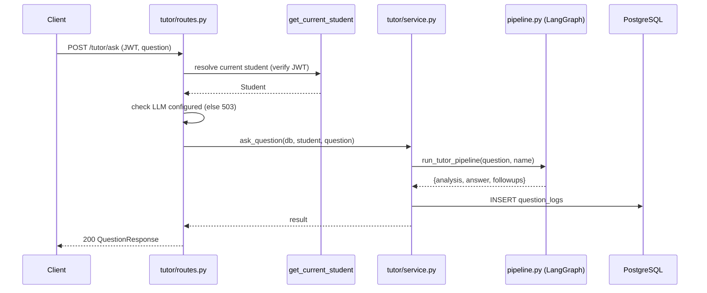
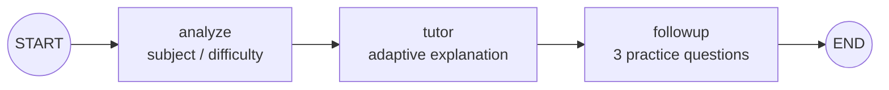

# Architecture Diagrams

_Last updated: 2026-07-08_

## Component overview

```mermaid
flowchart TD
    Client([Client])
    Client --> Main["app/main.py<br/>(FastAPI + lifespan)"]
    Main --> Index["app/api/router.py<br/>(route index)"]

    Index --> AuthR["features/auth/routes.py"]
    Index --> TutorR["features/tutor/routes.py"]

    AuthR --> AuthDep["auth/dependencies.py<br/>get_current_student"]
    AuthR --> AuthSvc["auth/service.py"]
    AuthSvc --> AuthModel["auth/models.py<br/>Student"]

    TutorR --> AuthDep
    TutorR --> TutorSvc["tutor/service.py"]
    TutorSvc --> Pipeline["tutor/pipeline.py<br/>(LangGraph)"]
    TutorSvc --> TutorModel["tutor/models.py<br/>QuestionLog"]

    AuthSvc --> Core["core/<br/>config · database · security"]
    TutorSvc --> Core
    AuthDep --> Core
    Pipeline --> LLM["core/llm.py<br/>(provider factory)"]

    AuthModel --> DB[(PostgreSQL)]
    TutorModel --> DB
    LLM --> Providers([Claude subscription ·<br/>Anthropic · OpenAI · Gemini ·<br/>Local OpenAI-compatible])
```

## Request lifecycle — POST /tutor/ask

```mermaid
sequenceDiagram
    participant C as Client
    participant R as tutor/routes.py
    participant D as get_current_student
    participant S as tutor/service.py
    participant P as pipeline.py (LangGraph)
    participant DB as PostgreSQL

    C->>R: POST /tutor/ask (JWT, question)
    R->>D: resolve current student (verify JWT)
    D-->>R: Student
    R->>R: check LLM configured (else 503)
    R->>S: ask_question(db, student, question)
    S->>P: run_tutor_pipeline(question, name)
    P-->>S: {analysis, answer, followups}
    S->>DB: INSERT question_logs
    S-->>R: result
    R-->>C: 200 QuestionResponse
```

## AI pipeline (LangGraph state graph)

```mermaid
flowchart LR
    START((START)) --> A[analyze<br/>subject / difficulty]
    A --> T[tutor<br/>adaptive explanation]
    T --> F[followup<br/>3 practice questions]
    F --> END((END))
```
