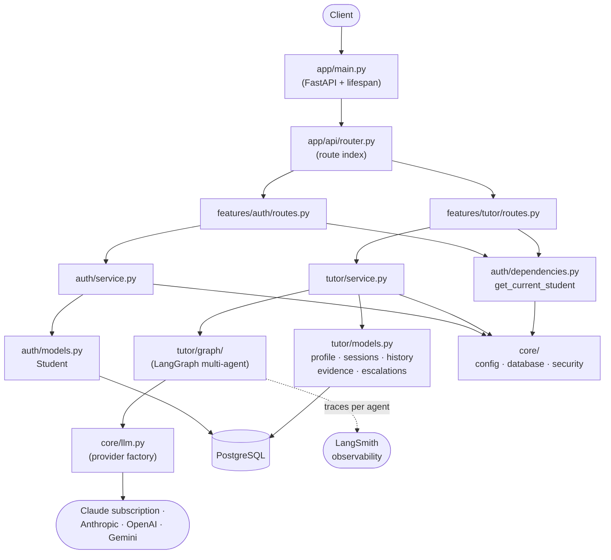
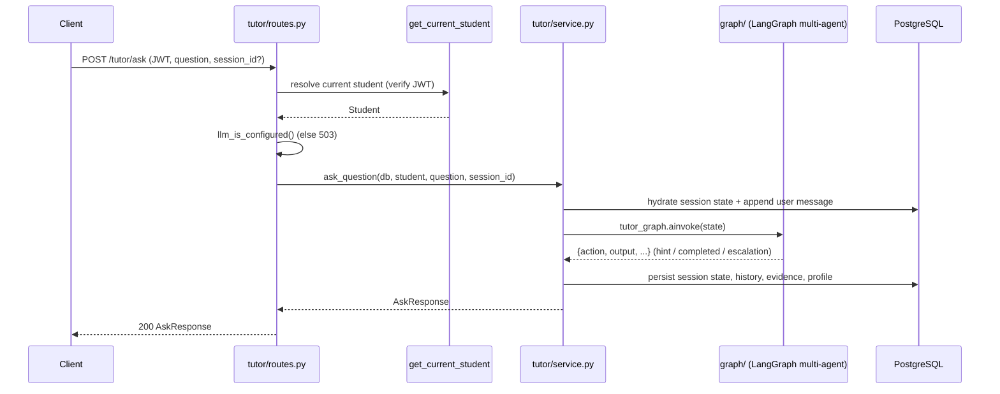
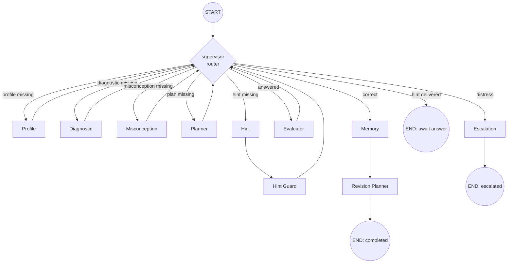
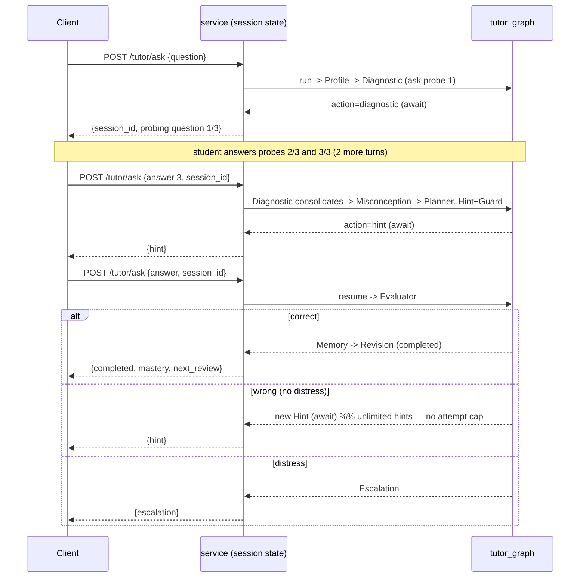

# Architecture Diagrams

_Last updated: 2026-07-08_

## Component overview

## Request lifecycle — POST /tutor/ask

## AI graph (LangGraph multi-agent, supervisor-routed)

The supervisor re-routes after every agent based on which state fields are filled
(see `graph/router.py`). A turn ends (`END`) either after a hint is delivered
(awaiting the student's answer) or after the memory/revision or escalation branch.

### Multi-turn loop (across API calls)

The session now opens with an **interactive Diagnostic phase**: the tutor asks 3 probing
questions (one per turn) before the first hint. The Misconception agent categorizes the
difficulty from that Q&A (`unsure_of_concept` / `misunderstanding_concept` /
`missing_prerequisite` / `none`).

### Context & conversation

Every turn the service loads the session's `conversation_history` (all prior
student/tutor messages) plus the current student message, and passes it into the
graph as `config.configurable.history`. Each LLM agent prepends this transcript
(student → HumanMessage, tutor → AIMessage) before its task, so no agent loses
context — the Evaluator, for example, judges the latest answer against the
**initial** question using every hint in between. A subject guardrail is appended
to each agent call at runtime (prompts unchanged). Fetch the typed transcript via
`GET /tutor/sessions/{id}/conversation`; list sessions via `GET /tutor/sessions`.
