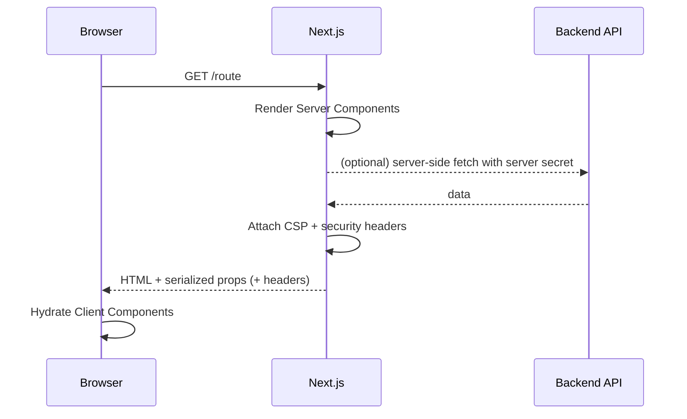
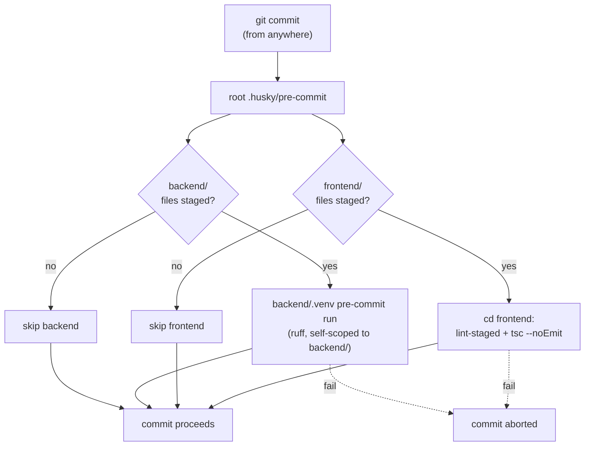

# Frontend Diagrams

## Rendering model (Next.js App Router)

```mermaid
flowchart TD
    Browser["Browser"] -->|HTTP request| Next["Next.js server (App Router)"]
    Next -->|"security headers + CSP (next.config.ts)"| Resp["Response"]
    Next --> RSC["Server Components (default)\nno secrets leak to client"]
    RSC -->|"serialized props"| Client["Client Components\n(\"use client\")"]
    RSC -.->|"server-side fetch"| Backend["Backend API (../backend)"]
    Resp --> Browser
    Client -->|"hydration"| Browser
```

Key points:

- **Server Components are the default.** Data fetching and secret use happen on
  the server; only serializable props cross into Client Components.
- **Security headers/CSP** are attached to every response by `next.config.ts`
  (`headers()` on `source: "/:path*"`).
- **Backend calls** should originate server-side (Server Component or Route
  Handler) so backend secrets never reach the browser bundle.

## Request → response with guardrails



## Commit-time guardrail flow (root Husky, path-gated)



> The hook is owned by the repo root, so it gates commits from either side. Each
> side's checks run only when that side has staged files.

> Diagrams use [Mermaid](https://mermaid.js.org), which GitHub renders natively.
> Update these whenever the rendering strategy, data flow, or commit checks
> change.
